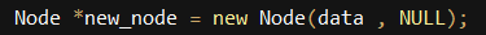
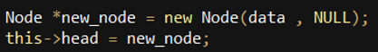
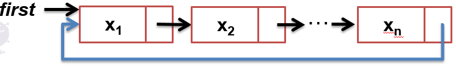

# Linked List
## Operations
### InsertBack<br>
* Insert the given data in the tail of list

```
    e.g. original list (head) : "A -> B" => InsertBack(C) => "A -> B -> C“
    e.g. original list (head) : "" => InsertBack(C) => "C"
```

### InsertFront
* Insert the given data in the head of list

```
    e.g. original list (head) : "A -> B" => InsertFront(C) => "C -> A -> B“
    e.g. original list (head) : "" => InsertFront(C) => "C"
```

### InsertAfter<br>
* Insert given data after data_ref
* If there is no data_ref in list, do nothing
```
    e.g. original list (head) : "A -> C" => InsertAfter(B, A) => "A -> B -> C“
    e.g. original list (head) : "A" => InsertAfter(C, B) => "A"
```
### InsertBefore<br>
* Insert given data before data_ref
* If there is no data_ref in list, do nothing
```
    e.g. original list (head) : "A -> C" => InsertBefore (B, A) => “ B->A->C “
    e.g. original list (head) : "A" => InsertBefore (C, B) => "A"
```
### Delete
* Delete specific data from list
* If data not in list, do nothing
```
    e.g. original list (head) : "A -> B -> C" => Delete(B) => "A -> C”
    e.g. original list (head) : "A -> B -> C" => Delete(Y) => "A -> B -> C"
```

### DeleteFront
* Delete the first element from list
```
    e.g. original list (head) : "A -> B -> C" => DeleteFront() => "B -> C“
    e.g. original list (head) : "" => DeleteFront() => ""
```

### DeleteBack
* Delete the last element from list
```
    e.g. original list (head) : "A -> B -> C" => DeleteBack() => "A->B“
    e.g. original list (head) : "" => DeleteBack() => ""
```
### Reverse
* Reverse the list
```
    e.g. original list (head) : "A -> B -> C" =>Reverse() => "C -> B -> A"
```
### Rotate
* Rotate the list to right by k places
```
    e.g. original list (head) : “A->B->C->D->E” => Rotate(2) => D->E->A->B->C

    Explanation 
        Rotate 1 step: E->A->B->C->D
        Rotate 2 step: D->E->A->B->C 
```


## Specification
* We have predefined function PrintChain() to check your answer

* Data type of each node is integer from 0~99999

* There is no duplicate number in a list

* In function rotate, k<100000

## Hints
* Create a new node with next element is NULL

* Create a new node, and assign it as head node for the list

* Hint for rotate: circular linked list
