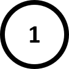
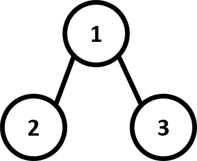
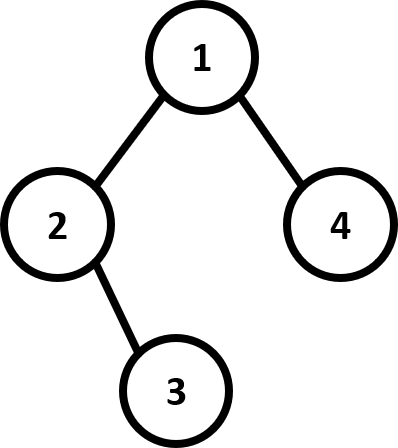
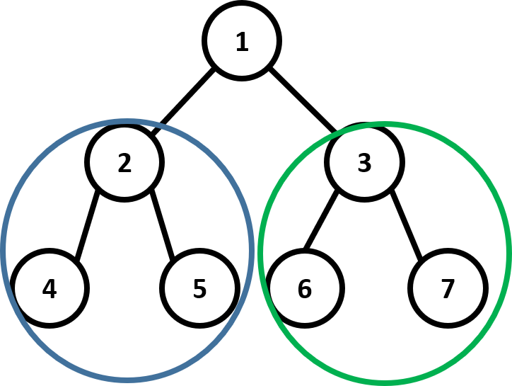
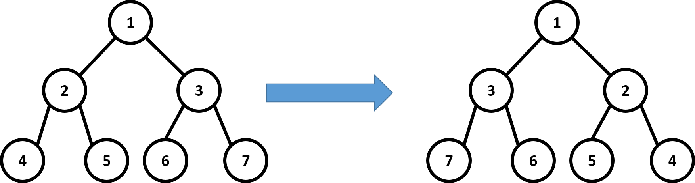
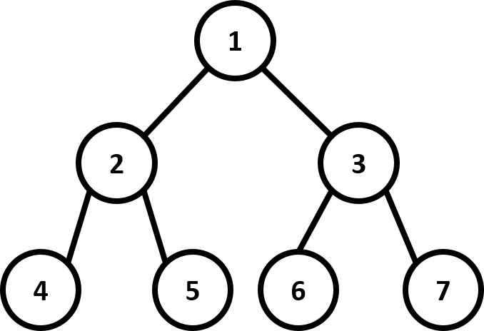

# Tree Representation
## S-Expression
* Tree can be recursively defined
* Tree = ( root (left_tree)(right_tree) )


### Example
* Empty tree = ()
* Tree with one node ( 1 ()() )

* Tree represented as <font color = "cyan">(</font>1<font color = "green">(</font>2()()<font color = "green">)</font><font color = "orange">(</font>3()()<font color = "orange">)</font><font color = "cyan">)</font>

* More Complicated Case<br>
    (1(2()(3()()))(4()()))

* More Complicated Case<br>
    (1(2(4()())(5()()))(3(6()())(7()())))


## Functions


### Construct_tree
* Construct a binary tree for the given s-expression
* Input: S-expression of binary tree<br>
    (1(2()(3()())) (4()())
* Output: A node, which is the root node of the binary tree represented by input s-expression


### Inorder traversal 
* Print every node’s weight in inorder
```
4 2 5 1 6 3 7
```

### Preorder traversal
* Print every node’s weight in preorder
```
1 2 4 5 3 6 7
```
### Postorder traversal
* Print every node’s weight in postorder
```
4 5 2 6 7 3 1
```

### Levelorder traversal
* Print every node’s weight in level order
```
1 2 3 4 5 6 7
```

### Tree height
* Calculate the tree height of a binary tree
* Input: root of the binary tree

* Output: an integer, indicating the height of the tree
```
In this example, height = 3
```
### Tree weight sum
* Sum of all the node weights in the binary tree

* Input: the root of the tree

* Output: the sum of weights of all the nodes
```
In this example, sum = 28
```

### Maximum Path Sum
* Find a path from root to leaf,
such that the summation of node weights
 in the path is maximum.

* Input: the root of the tree
* Output: the maximum sum of the path
In this example, output 11 (1->3->7)


### Invert
* Invert binary tree
* Problem of google interview

* Input: the root of the tree
* Output: the root of the tree, where the nodes in this tree are reversed
<br>



## Hints
* Parse the given string to find the root, the left sub-tree and the right sub-tree.
```
(1(2(4()())(5()()))(3(6()())(7()())))
Root = 1
Left sub-tree = (2(4()())(5()()))
Right sub-tree = (3(6()())(7()()))
```
How to identify sub-trees?

* Note that a tree must start with a ‘(‘ and end with a ‘)’

* You can use a stack to match ‘(‘ and ‘)’
```
Push a ‘(‘ in the beginning, and pop when seeing a ’)’
When the stack is empty, a sub-tree is built
```

* Or you can simply use a variable to do this

## Example
### Input: 
we will give you a string of s-expression, and you need to construct a tree from the string

```
(1(2(4()())(5()()))(3(6()())(7()())))
```


### Output
```
4 2 5 1 6 3 7       Inorder traversal
1 2 4 5 3 6 7       Preorder traversal
4 5 2 6 7 3 1       Postorder traversal
1 2 3 4 5 6 7       Levelorder traversal
3                   Height of tree
28                  Weight sum of tree
11                  Maximum path sum of tree
7 3 6 1 5 2 4       Inorder traversal after inverting
1 3 7 6 2 5 4       Preorder traversal after inverting
7 6 3 5 4 2 1       Postorder traversal after inverting
1 3 2 7 6 5 4       Levelorder traversal after inverting

```


