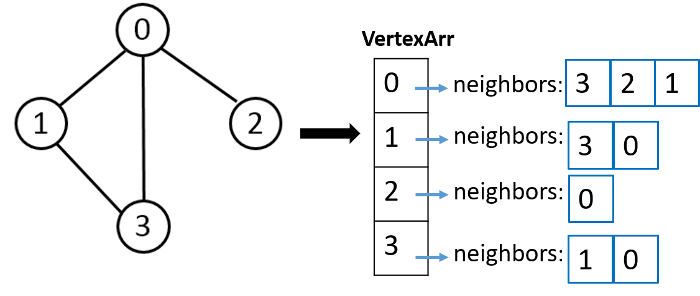
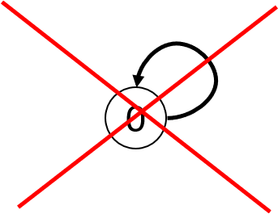
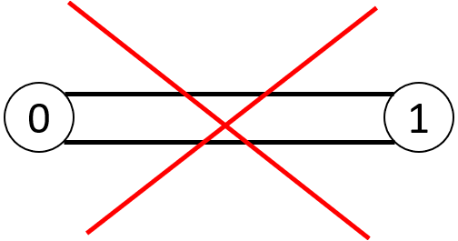
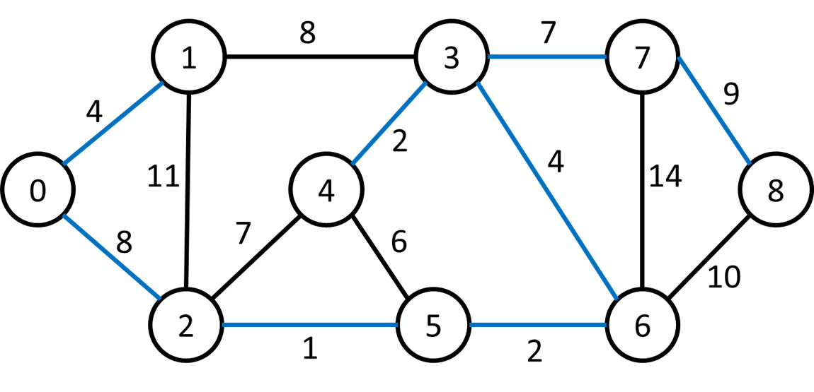
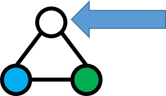

# Graph
## Definition
* A Graph is represented as follows



* Warnings
1. No self loops<br>

2. No multiple edges<br>


## Functions

### addEdge
* Input: three integers: the teriminals of the edge and its weight
```
    E.g., add 0 1 4
    Add a new edge between node 0 and node 1 with edge weight 4
```


``` 
Example 
add 0 1 4
add 0 2 8
add 1 2 11
add 1 3 8
add 2 4 7
add 3 4 2
add 2 5 1
add 4 5 6
add 3 6 4
add 5 6 2
add 3 7 7
add 6 7 14
add 7 8 9
add 6 8 10
```


### shortest_path
* Input: two integers indicating the two node ids to be compute shortest path   length between
```
    E.g. shortest_path 0 3
```

* Output: the length of the shortest path length between two nodes
```
    In this example
    “shortest_path 0 3” outputs 12
```


### mst_weight
* Takes no input

* Output the sum of edge weights of the minimum spanning tree
```
    E.g., calling “mst_weight” outputs 37
```


### two_colorable
* Check if a given graph is two-colorable
#### Definition of two-colorable
* Color every vertex in a graph with two colors
* Any adjacent vertices cannot be colored with the same color
* If a graph can be colored with two color only, we say the graph is two colorable
* If the graph is two-colorable, output two-colorable
* If the graph is NOT two-colorable, output not two-colorable


#### Two colorable


### Not two colorable
